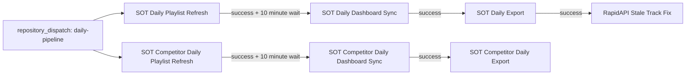

# Daily data pipeline

The daily SpotOnTrack pipeline follows successful workflow completions instead of
waiting for staggered GitHub schedules. Own-catalog and competitor workflows,
concurrency groups, configs, and Supabase schemas remain separate.



Each downstream workflow listens for `workflow_run` with `types: [completed]` and
runs its job only when the upstream conclusion is `success`. Unsuccessful upstream
conclusions stop that chain. Dashboard sync first
waits 600 seconds on chained runs so SpotOnTrack can process playlist refreshes.
Manual and cron syncs do not wait.

GitHub requires the `workflow_run` and `repository_dispatch` workflow definitions
to exist on the default branch (`main`); merge these changes before enabling the
external scheduler. Chained runs check out the default branch. The own-catalog
chain uses GitHub's maximum of three downstream `workflow_run` levels.
See [GitHub workflow events](https://docs.github.com/en/actions/reference/workflows-and-actions/events-that-trigger-workflows).

## External head trigger

Configure an external scheduler to make one request daily, for example at 05:07
UTC (09:07 Dubai). It starts both playlist-refresh workflows independently:

```http
POST https://api.github.com/repos/niksaxena1/StreamBase/dispatches
Authorization: Bearer <fine-grained-PAT>
Accept: application/vnd.github+json
Content-Type: application/json

{"event_type":"daily-pipeline"}
```

Create a fine-grained personal access token restricted to `niksaxena1/StreamBase`
with **Contents: read & write**. Store it as a secret in the external scheduler.
A successful dispatch returns HTTP 204; monitor Actions to confirm both heads ran.
See [GitHub repository dispatch API](https://docs.github.com/en/rest/repos/repos#create-a-repository-dispatch-event).

Example for a scheduler with a Bash environment and a secret `STREAMBASE_PAT`:

```bash
curl --fail-with-body --silent --show-error \
  -X POST https://api.github.com/repos/niksaxena1/StreamBase/dispatches \
  -H "Authorization: Bearer $STREAMBASE_PAT" \
  -H "Accept: application/vnd.github+json" \
  -H "Content-Type: application/json" \
  -d '{"event_type":"daily-pipeline"}'
```

Repository dispatch avoids the delayed GitHub cron head, but runner queuing and
SpotOnTrack processing can still delay completion. The external scheduler is
configured separately; committing these workflows does not create that schedule.

## Fallback schedules and run dates

All existing manual triggers remain available. Each workflow keeps one daily cron
as a fallback; GitHub may start these runs late.

| Workflow | Cron (UTC) | Dubai time |
| --- | --- | --- |
| SOT Daily Playlist Refresh | `7 5 * * *` | 09:07 |
| SOT Daily Dashboard Sync | `11 6 * * *` | 10:11 |
| SOT Daily Export | `43 7 * * *` | 11:43 |
| RapidAPI Stale Track Fix | `41 9 * * *` | 13:41 |
| SOT Competitor Daily Playlist Refresh | `23 5 * * *` | 09:23 |
| SOT Competitor Daily Dashboard Sync | `53 8 * * *` | 12:53 |
| SOT Competitor Daily Export | `29 11 * * *` | 15:29 |

Sync fallback prechecks skip work if that universe has already synced successfully
today. Export prechecks skip dates already successfully ingested into their own
schema. Both exports still require a successful same-day dashboard sync on `main`,
regardless of its event type, so `workflow_run` syncs satisfy the gate. Own export
fails if the gate cannot be verified; competitor export skips the attempt. A later
successful sync triggers a fresh export even if its fallback cron already ran.

Exports compute `RUN_DATE` as UTC today when the job runs, or the explicit
`run_date` supplied to a manual export. Refresh and sync have no run-date input;
inputs from an upstream manual run are not forwarded to downstream workflows.
Runs crossing UTC midnight retain these existing date semantics. The stale-fix
script uses UTC today and requires today's own-catalog stale-ingestion warning;
its cron behavior is unchanged. A chained stale fix follows a successful own
export, including an export that skipped because today's ingestion already exists.

Any successful manual refresh or sync also starts its downstream chain. Manual
preview/limit inputs do not propagate: a successful dry run can start real
downstream work. Historical manual exports can trigger a stale fix for UTC today.

## Incremental dashboard sync

Both sync workflows restore the latest state under separate cache prefixes:
`sot-sync-state-own-` / `sot-sync-state-competitor-`. They pass
`--state-file .sync-state/own.json` / `--state-file .sync-state/competitor.json` and
provide Spotify client credentials and Supabase service-role credentials from the
existing repository secrets. A missing cache leaves the script to initialize its
state. Each run saves state after sync with an `always()` condition, including
partial progress on failure, under a key ending in its `github.run_id`.
See [saving caches after failures](https://github.com/actions/cache/tree/main/save#always-save-cache).

The script must support `--state-file` and `--full` when this is merged. Sync adds
`--full` on Sundays UTC or when its new manual boolean input `full_sync` is true.
Other days use the script's incremental behavior. Cache entries are immutable;
rerunning the same run ID can restore its existing entry but cannot overwrite it.

## Watchdogs

Own and competitor ingestion watchdogs keep their existing 13:53 / 14:29 UTC
crons and manual triggers. The competitor stale-summary RPC normally returns a
row list (`RETURNS TABLE`), but PostgREST can also return a single object or an
error object. Because `curl` returns HTTP error bodies without `--fail`, assuming
every nonempty JSON response supports `d[0]` caused `KeyError: 0` on an object.

Both watchdogs now normalize ingestion responses before reading fields. The
competitor stale-summary parser accepts list/object responses and reports `?` for
errors, empty, malformed, or invalid count responses without failing the job.
The own watchdog does not call that RPC, but had the same list-only ingestion
parsing. Unknown ingestion status still produces the existing incomplete-data
notification; an unknown stale count remains informational.
